# Emilda Governance OS architecture and core data model

Portable editable diagrams for the V1 deployment and tenant-scoped governance model.

## One deployment, isolated tenant data

```mermaid
flowchart LR
  accTitle: One deployment, isolated tenant data
  accDescr: Users enter through tenant subdomains. Next.js resolves tenant and authenticates the user. User-scoped Supabase calls enforce RLS. Private evidence is served with short-lived signed URLs. Optional AI receives only RLS-filtered snippets.
  user["Tenant user"]
  vercel["Vercel wildcard edge"]
  next["Next.js App Router"]
  auth["Supabase Auth"]
  postgres["PostgreSQL + forced RLS"]
  storage["Private evidence storage"]
  openai["Optional OpenAI Responses API"]
  cron["Protected hourly cron"]
  user -->|client.emildaos.com| vercel
  vercel -->|tenant header| next
  next -->|cookie session| auth
  next -->|user-scoped queries| postgres
  next -->|60-second signed access| storage
  next -->|authorized snippets only| openai
  cron -->|Bearer secret| next
  postgres ---|tenant attachment metadata| storage
%% portable-canonical-v2:eyJhY2Nlc3NpYmlsaXR5IjoiVXNlcnMgZW50ZXIgdGhyb3VnaCB0ZW5hbnQgc3ViZG9tYWlucy4gTmV4dC5qcyByZXNvbHZlcyB0ZW5hbnQgYW5kIGF1dGhlbnRpY2F0ZXMgdGhlIHVzZXIuIFVzZXItc2NvcGVkIFN1cGFiYXNlIGNhbGxzIGVuZm9yY2UgUkxTLiBQcml2YXRlIGV2aWRlbmNlIGlzIHNlcnZlZCB3aXRoIHNob3J0LWxpdmVkIHNpZ25lZCBVUkxzLiBPcHRpb25hbCBBSSByZWNlaXZlcyBvbmx5IFJMUy1maWx0ZXJlZCBzbmlwcGV0cy4iLCJkYXRhIjp7ImRpcmVjdGlvbiI6IkxSIiwiZWRnZXMiOlt7ImFycm93IjoiLS0-IiwiZnJvbSI6InVzZXIiLCJsYWJlbCI6ImNsaWVudC5lbWlsZGFvcy5jb20iLCJ0byI6InZlcmNlbCJ9LHsiYXJyb3ciOiItLT4iLCJmcm9tIjoidmVyY2VsIiwibGFiZWwiOiJ0ZW5hbnQgaGVhZGVyIiwidG8iOiJuZXh0In0seyJhcnJvdyI6Ii0tPiIsImZyb20iOiJuZXh0IiwibGFiZWwiOiJjb29raWUgc2Vzc2lvbiIsInRvIjoiYXV0aCJ9LHsiYXJyb3ciOiItLT4iLCJmcm9tIjoibmV4dCIsImxhYmVsIjoidXNlci1zY29wZWQgcXVlcmllcyIsInRvIjoicG9zdGdyZXMifSx7ImFycm93IjoiLS0-IiwiZnJvbSI6Im5leHQiLCJsYWJlbCI6IjYwLXNlY29uZCBzaWduZWQgYWNjZXNzIiwidG8iOiJzdG9yYWdlIn0seyJhcnJvdyI6Ii0tPiIsImZyb20iOiJuZXh0IiwibGFiZWwiOiJhdXRob3JpemVkIHNuaXBwZXRzIG9ubHkiLCJ0byI6Im9wZW5haSJ9LHsiYXJyb3ciOiItLT4iLCJmcm9tIjoiY3JvbiIsImxhYmVsIjoiQmVhcmVyIHNlY3JldCIsInRvIjoibmV4dCJ9LHsiYXJyb3ciOiItLS0iLCJmcm9tIjoicG9zdGdyZXMiLCJsYWJlbCI6InRlbmFudCBhdHRhY2htZW50IG1ldGFkYXRhIiwidG8iOiJzdG9yYWdlIn1dLCJub2RlcyI6W3siaWQiOiJ1c2VyIiwibGFiZWwiOiJUZW5hbnQgdXNlciJ9LHsiaWQiOiJ2ZXJjZWwiLCJsYWJlbCI6IlZlcmNlbCB3aWxkY2FyZCBlZGdlIn0seyJpZCI6Im5leHQiLCJsYWJlbCI6Ik5leHQuanMgQXBwIFJvdXRlciJ9LHsiaWQiOiJhdXRoIiwibGFiZWwiOiJTdXBhYmFzZSBBdXRoIn0seyJpZCI6InBvc3RncmVzIiwibGFiZWwiOiJQb3N0Z3JlU1FMICsgZm9yY2VkIFJMUyJ9LHsiaWQiOiJzdG9yYWdlIiwibGFiZWwiOiJQcml2YXRlIGV2aWRlbmNlIHN0b3JhZ2UifSx7ImlkIjoib3BlbmFpIiwibGFiZWwiOiJPcHRpb25hbCBPcGVuQUkgUmVzcG9uc2VzIEFQSSJ9LHsiaWQiOiJjcm9uIiwibGFiZWwiOiJQcm90ZWN0ZWQgaG91cmx5IGNyb24ifV19LCJkZXNjcmlwdGlvbiI6bnVsbCwiaWQiOiJkZXBsb3ltZW50X2FyY2hpdGVjdHVyZSIsImtpbmQiOiJmbG93Y2hhcnQiLCJzb3VyY2VTaGEyNTYiOiI5MDI3ZjE4MjhjOTE1YzA2OGIwYzU2N2JiMDdmZjc5NDk4MTFmNDY5MGI2M2VmOWFkOWI5ZGIyZGUyZTc4OGI2Iiwic3R5bGVzIjpbXSwidGl0bGUiOiJPbmUgZGVwbG95bWVudCwgaXNvbGF0ZWQgdGVuYW50IGRhdGEiLCJ2ZXJzaW9uIjoxfQ
```

<!-- mermaid:id=deployment_architecture -->



## Governance improvement loop

```mermaid
flowchart LR
  accTitle: Governance improvement loop
  accDescr: A process is designed, approved, released, run by its owner, audited, and improved through issues and change requests. Approved change requests create a new draft and repeat the approval path.
  design["Design draft"]
  approve["Owner approval"]
  release["Process release"]
  run["Owner runs process"]
  audit["Guardian audit"]
  issue["Issue + root cause"]
  change["Change request"]
  version["New draft version"]
  design -->|submit| approve
  approve -->|approved| release
  release -->|go live| run
  run -->|evidence| audit
  audit -->|failure detected| issue
  issue -->|process should change| change
  change -->|approved| version
  version -->|edit safely| design
%% portable-canonical-v2:eyJhY2Nlc3NpYmlsaXR5IjoiQSBwcm9jZXNzIGlzIGRlc2lnbmVkLCBhcHByb3ZlZCwgcmVsZWFzZWQsIHJ1biBieSBpdHMgb3duZXIsIGF1ZGl0ZWQsIGFuZCBpbXByb3ZlZCB0aHJvdWdoIGlzc3VlcyBhbmQgY2hhbmdlIHJlcXVlc3RzLiBBcHByb3ZlZCBjaGFuZ2UgcmVxdWVzdHMgY3JlYXRlIGEgbmV3IGRyYWZ0IGFuZCByZXBlYXQgdGhlIGFwcHJvdmFsIHBhdGguIiwiZGF0YSI6eyJkaXJlY3Rpb24iOiJMUiIsImVkZ2VzIjpbeyJhcnJvdyI6Ii0tPiIsImZyb20iOiJkZXNpZ24iLCJsYWJlbCI6InN1Ym1pdCIsInRvIjoiYXBwcm92ZSJ9LHsiYXJyb3ciOiItLT4iLCJmcm9tIjoiYXBwcm92ZSIsImxhYmVsIjoiYXBwcm92ZWQiLCJ0byI6InJlbGVhc2UifSx7ImFycm93IjoiLS0-IiwiZnJvbSI6InJlbGVhc2UiLCJsYWJlbCI6ImdvIGxpdmUiLCJ0byI6InJ1biJ9LHsiYXJyb3ciOiItLT4iLCJmcm9tIjoicnVuIiwibGFiZWwiOiJldmlkZW5jZSIsInRvIjoiYXVkaXQifSx7ImFycm93IjoiLS0-IiwiZnJvbSI6ImF1ZGl0IiwibGFiZWwiOiJmYWlsdXJlIGRldGVjdGVkIiwidG8iOiJpc3N1ZSJ9LHsiYXJyb3ciOiItLT4iLCJmcm9tIjoiaXNzdWUiLCJsYWJlbCI6InByb2Nlc3Mgc2hvdWxkIGNoYW5nZSIsInRvIjoiY2hhbmdlIn0seyJhcnJvdyI6Ii0tPiIsImZyb20iOiJjaGFuZ2UiLCJsYWJlbCI6ImFwcHJvdmVkIiwidG8iOiJ2ZXJzaW9uIn0seyJhcnJvdyI6Ii0tPiIsImZyb20iOiJ2ZXJzaW9uIiwibGFiZWwiOiJlZGl0IHNhZmVseSIsInRvIjoiZGVzaWduIn1dLCJub2RlcyI6W3siaWQiOiJkZXNpZ24iLCJsYWJlbCI6IkRlc2lnbiBkcmFmdCJ9LHsiaWQiOiJhcHByb3ZlIiwibGFiZWwiOiJPd25lciBhcHByb3ZhbCJ9LHsiaWQiOiJyZWxlYXNlIiwibGFiZWwiOiJQcm9jZXNzIHJlbGVhc2UifSx7ImlkIjoicnVuIiwibGFiZWwiOiJPd25lciBydW5zIHByb2Nlc3MifSx7ImlkIjoiYXVkaXQiLCJsYWJlbCI6Ikd1YXJkaWFuIGF1ZGl0In0seyJpZCI6Imlzc3VlIiwibGFiZWwiOiJJc3N1ZSArIHJvb3QgY2F1c2UifSx7ImlkIjoiY2hhbmdlIiwibGFiZWwiOiJDaGFuZ2UgcmVxdWVzdCJ9LHsiaWQiOiJ2ZXJzaW9uIiwibGFiZWwiOiJOZXcgZHJhZnQgdmVyc2lvbiJ9XX0sImRlc2NyaXB0aW9uIjpudWxsLCJpZCI6ImdvdmVybmFuY2VfbG9vcCIsImtpbmQiOiJmbG93Y2hhcnQiLCJzb3VyY2VTaGEyNTYiOiI5YmFiN2VhOWQ4NGU4YjkwZThlMGY1M2E2NGQ0ZjQyMTYwNTE1MGY4ZTYyMmQ0M2IwYTdlZjY3ZmJiOWE5MmRhIiwic3R5bGVzIjpbXSwidGl0bGUiOiJHb3Zlcm5hbmNlIGltcHJvdmVtZW50IGxvb3AiLCJ2ZXJzaW9uIjoxfQ
```

<!-- mermaid:id=governance_loop -->



## Core tenant-scoped data model

<!-- mermaid:id=core_data_model -->

```mermaid
erDiagram
  accTitle: Core tenant-scoped data model
  accDescr: Every business record belongs to one tenant. Processes own immutable versions, graph content, releases, audits, issues, and improvements.
  TENANT {
    uuid id PK
    text slug UK
  }
  MEMBERSHIP {
    uuid id PK
    uuid tenant_id FK
    uuid user_id FK
  }
  PROCESS {
    uuid id PK
    uuid tenant_id FK
    uuid active_version_id FK
  }
  VERSION {
    uuid id PK
    uuid tenant_id FK
    uuid process_id FK
    status immutable_after_approval
  }
  NODE {
    uuid id PK
    uuid tenant_id FK
    uuid version_id FK
  }
  EDGE {
    uuid id PK
    uuid tenant_id FK
    uuid version_id FK
  }
  RELEASE {
    uuid id PK
    jsonb snapshot
    text snapshot_hash
  }
  APPROVAL {
    uuid id PK
    int content_revision
    status
  }
  AUDIT {
    uuid id PK
    uuid version_id FK
    health score
  }
  ISSUE {
    uuid id PK
    uuid process_id FK
    root_cause
  }
  CHANGE_REQUEST {
    uuid id PK
    uuid created_version_id FK
    status
  }
  ATTACHMENT {
    uuid id PK
    uuid tenant_id FK
    private object_path
  }
  ACTIVITY_LOG {
    uuid id PK
    uuid tenant_id FK
    immutable event
  }
  TENANT ||--o{ MEMBERSHIP : "has"
  TENANT ||--o{ PROCESS : "owns"
  PROCESS ||--o{ VERSION : "versions"
  VERSION ||--o{ NODE : "steps"
  VERSION ||--o{ EDGE : "connections"
  VERSION ||--o{ APPROVAL : "requires"
  VERSION ||--o| RELEASE : "snapshots"
  VERSION ||--o{ AUDIT : "audited_as"
  PROCESS ||--o{ ISSUE : "reveals"
  ISSUE o{--o{ CHANGE_REQUEST : "supports"
  CHANGE_REQUEST o|--o| VERSION : "creates"
  PROCESS ||--o{ ATTACHMENT : "secures"
  TENANT ||--o{ ACTIVITY_LOG : "records"
%% portable-canonical-v2:eyJhY2Nlc3NpYmlsaXR5IjoiRXZlcnkgYnVzaW5lc3MgcmVjb3JkIGJlbG9uZ3MgdG8gb25lIHRlbmFudC4gUHJvY2Vzc2VzIG93biBpbW11dGFibGUgdmVyc2lvbnMsIGdyYXBoIGNvbnRlbnQsIHJlbGVhc2VzLCBhdWRpdHMsIGlzc3VlcywgYW5kIGltcHJvdmVtZW50cy4iLCJkYXRhIjp7ImVudGl0aWVzIjpbeyJhdHRyaWJ1dGVzIjpbInV1aWQgaWQgUEsiLCJ0ZXh0IHNsdWcgVUsiXSwiaWQiOiJURU5BTlQifSx7ImF0dHJpYnV0ZXMiOlsidXVpZCBpZCBQSyIsInV1aWQgdGVuYW50X2lkIEZLIiwidXVpZCB1c2VyX2lkIEZLIl0sImlkIjoiTUVNQkVSU0hJUCJ9LHsiYXR0cmlidXRlcyI6WyJ1dWlkIGlkIFBLIiwidXVpZCB0ZW5hbnRfaWQgRksiLCJ1dWlkIGFjdGl2ZV92ZXJzaW9uX2lkIEZLIl0sImlkIjoiUFJPQ0VTUyJ9LHsiYXR0cmlidXRlcyI6WyJ1dWlkIGlkIFBLIiwidXVpZCB0ZW5hbnRfaWQgRksiLCJ1dWlkIHByb2Nlc3NfaWQgRksiLCJzdGF0dXMgaW1tdXRhYmxlX2FmdGVyX2FwcHJvdmFsIl0sImlkIjoiVkVSU0lPTiJ9LHsiYXR0cmlidXRlcyI6WyJ1dWlkIGlkIFBLIiwidXVpZCB0ZW5hbnRfaWQgRksiLCJ1dWlkIHZlcnNpb25faWQgRksiXSwiaWQiOiJOT0RFIn0seyJhdHRyaWJ1dGVzIjpbInV1aWQgaWQgUEsiLCJ1dWlkIHRlbmFudF9pZCBGSyIsInV1aWQgdmVyc2lvbl9pZCBGSyJdLCJpZCI6IkVER0UifSx7ImF0dHJpYnV0ZXMiOlsidXVpZCBpZCBQSyIsImpzb25iIHNuYXBzaG90IiwidGV4dCBzbmFwc2hvdF9oYXNoIl0sImlkIjoiUkVMRUFTRSJ9LHsiYXR0cmlidXRlcyI6WyJ1dWlkIGlkIFBLIiwiaW50IGNvbnRlbnRfcmV2aXNpb24iLCJzdGF0dXMiXSwiaWQiOiJBUFBST1ZBTCJ9LHsiYXR0cmlidXRlcyI6WyJ1dWlkIGlkIFBLIiwidXVpZCB2ZXJzaW9uX2lkIEZLIiwiaGVhbHRoIHNjb3JlIl0sImlkIjoiQVVESVQifSx7ImF0dHJpYnV0ZXMiOlsidXVpZCBpZCBQSyIsInV1aWQgcHJvY2Vzc19pZCBGSyIsInJvb3RfY2F1c2UiXSwiaWQiOiJJU1NVRSJ9LHsiYXR0cmlidXRlcyI6WyJ1dWlkIGlkIFBLIiwidXVpZCBjcmVhdGVkX3ZlcnNpb25faWQgRksiLCJzdGF0dXMiXSwiaWQiOiJDSEFOR0VfUkVRVUVTVCJ9LHsiYXR0cmlidXRlcyI6WyJ1dWlkIGlkIFBLIiwidXVpZCB0ZW5hbnRfaWQgRksiLCJwcml2YXRlIG9iamVjdF9wYXRoIl0sImlkIjoiQVRUQUNITUVOVCJ9LHsiYXR0cmlidXRlcyI6WyJ1dWlkIGlkIFBLIiwidXVpZCB0ZW5hbnRfaWQgRksiLCJpbW11dGFibGUgZXZlbnQiXSwiaWQiOiJBQ1RJVklUWV9MT0cifV0sInJlbGF0aW9uc2hpcHMiOlt7ImNhcmRpbmFsaXR5IjoifHwtLW97IiwiZnJvbSI6IlRFTkFOVCIsImxhYmVsIjoiaGFzIiwidG8iOiJNRU1CRVJTSElQIn0seyJjYXJkaW5hbGl0eSI6Inx8LS1veyIsImZyb20iOiJURU5BTlQiLCJsYWJlbCI6Im93bnMiLCJ0byI6IlBST0NFU1MifSx7ImNhcmRpbmFsaXR5IjoifHwtLW97IiwiZnJvbSI6IlBST0NFU1MiLCJsYWJlbCI6InZlcnNpb25zIiwidG8iOiJWRVJTSU9OIn0seyJjYXJkaW5hbGl0eSI6Inx8LS1veyIsImZyb20iOiJWRVJTSU9OIiwibGFiZWwiOiJzdGVwcyIsInRvIjoiTk9ERSJ9LHsiY2FyZGluYWxpdHkiOiJ8fC0tb3siLCJmcm9tIjoiVkVSU0lPTiIsImxhYmVsIjoiY29ubmVjdGlvbnMiLCJ0byI6IkVER0UifSx7ImNhcmRpbmFsaXR5IjoifHwtLW97IiwiZnJvbSI6IlZFUlNJT04iLCJsYWJlbCI6InJlcXVpcmVzIiwidG8iOiJBUFBST1ZBTCJ9LHsiY2FyZGluYWxpdHkiOiJ8fC0tb3wiLCJmcm9tIjoiVkVSU0lPTiIsImxhYmVsIjoic25hcHNob3RzIiwidG8iOiJSRUxFQVNFIn0seyJjYXJkaW5hbGl0eSI6Inx8LS1veyIsImZyb20iOiJWRVJTSU9OIiwibGFiZWwiOiJhdWRpdGVkX2FzIiwidG8iOiJBVURJVCJ9LHsiY2FyZGluYWxpdHkiOiJ8fC0tb3siLCJmcm9tIjoiUFJPQ0VTUyIsImxhYmVsIjoicmV2ZWFscyIsInRvIjoiSVNTVUUifSx7ImNhcmRpbmFsaXR5Ijoib3stLW97IiwiZnJvbSI6IklTU1VFIiwibGFiZWwiOiJzdXBwb3J0cyIsInRvIjoiQ0hBTkdFX1JFUVVFU1QifSx7ImNhcmRpbmFsaXR5Ijoib3wtLW98IiwiZnJvbSI6IkNIQU5HRV9SRVFVRVNUIiwibGFiZWwiOiJjcmVhdGVzIiwidG8iOiJWRVJTSU9OIn0seyJjYXJkaW5hbGl0eSI6Inx8LS1veyIsImZyb20iOiJQUk9DRVNTIiwibGFiZWwiOiJzZWN1cmVzIiwidG8iOiJBVFRBQ0hNRU5UIn0seyJjYXJkaW5hbGl0eSI6Inx8LS1veyIsImZyb20iOiJURU5BTlQiLCJsYWJlbCI6InJlY29yZHMiLCJ0byI6IkFDVElWSVRZX0xPRyJ9XX0sImRlc2NyaXB0aW9uIjpudWxsLCJpZCI6ImNvcmVfZGF0YV9tb2RlbCIsImtpbmQiOiJlciIsInNvdXJjZVNoYTI1NiI6ImM2MDUxYjBkZmM4ZjliNWNhYTJiMDIzNzhiZGNmYWI5Y2U1ODFiYzVlYjYxNjA3YTRiYzliMzhmN2VjMWMyODEiLCJzdHlsZXMiOltdLCJ0aXRsZSI6IkNvcmUgdGVuYW50LXNjb3BlZCBkYXRhIG1vZGVsIiwidmVyc2lvbiI6MX0
```
